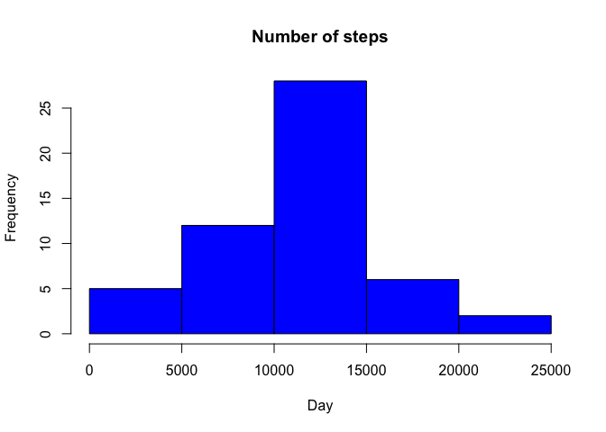
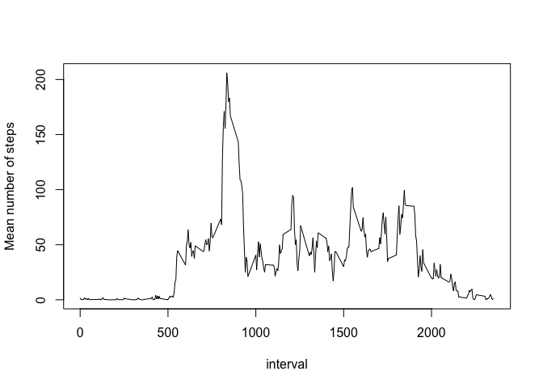
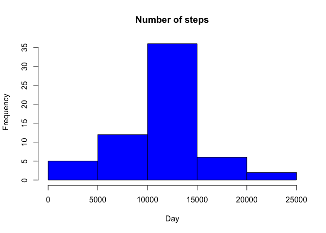
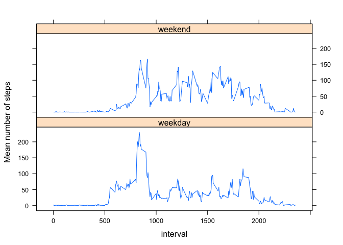

# Reproducible Research: Peer Assessment 1


## Loading and preprocessing the data

Read the data and convert the variable `date` to class Date

```r
dat <- read.csv(file = "activity.csv", sep = ",", header = TRUE)
dat$date <- as.Date(dat$date)
```


```r
head(dat)
```

```
##   steps       date interval
## 1    NA 2012-10-01        0
## 2    NA 2012-10-01        5
## 3    NA 2012-10-01       10
## 4    NA 2012-10-01       15
## 5    NA 2012-10-01       20
## 6    NA 2012-10-01       25
```

## What is mean total number of steps taken per day?


```r
library(dplyr)
```
Calculate the total number of steps taken per day

```r
dat_by_day <- group_by(dat, date)
datsum <- summarize(dat_by_day, sum = sum(steps))
```

Make a histogram of the total number of steps taken each day

```r
with(datsum, hist(sum, main = "Number of steps", xlab = "Day", col = "blue"))
```

 

Calculate and report the mean and median of the total number of steps taken per day

```r
steps_mean <- mean(datsum$sum, na.rm=TRUE)
steps_median <- median(datsum$sum, na.rm=TRUE)
```

Mean number of steps **10766.19**  
Median number of steps **10765**

## What is the average daily activity pattern?

Make a time series plot (i.e. type = "l") of the 5-minute interval (x-axis) and the average number of steps taken, averaged across all days (y-axis)

Calculate the mean number of steps for each interval

```r
dat_by_int <- group_by(dat, interval)
intmean <- summarize(dat_by_int, mean = mean(steps, na.rm=TRUE))
```

Make a plot

```r
with(intmean, 
     plot(interval, mean, xlab = "interval", ylab = "Mean number of steps", type = "l"))
```

 

Which 5-minute interval, on average across all the days in the dataset, contains the maximum number of steps?

```r
max_steps <- max(intmean$mean)
intmean[intmean$mean==max_steps,]
```

```
## Source: local data frame [1 x 2]
## 
##   interval     mean
## 1      835 206.1698
```

Interval **835** contains the maximum number of steps

## Imputing missing values

Calculate and report the total number of missing values in the dataset (i.e. the total number of rows with NAs)


```r
sum(is.na(dat$steps))
```

```
## [1] 2304
```

Strategy:  
1. Select only the rows with NA's  
2. Get the interval values  
3. Match the interval values of the NA's with the interval values of calculated means  


```r
indxNA <- dat[which(is.na(dat$steps)),]
indxNAint <- dat[which(is.na(dat$steps)),"interval"]  
replNA <- intmean[match(indxNAint,intmean$interval),"mean"]
```

Create a new dataset that is equal to the original dataset but with the missing data filled in.

```r
dat_replNA <- dat
dat_replNA[is.na(dat_replNA$steps),"steps"] <- replNA
```

Check if there are no NA's in the data

```r
dat_replNA[is.na(dat_replNA$steps),"steps"]
```

```
## numeric(0)
```

Make a histogram of the total number of steps taken each day and Calculate and report the mean and median total number of steps taken per day. Do these values differ from the estimates from the first part of the assignment? What is the impact of imputing missing data on the estimates of the total daily number of steps?


```r
dat_replNA_by_day <- group_by(dat_replNA, date)
datsum2 <- summarize(dat_replNA_by_day, sum = sum(steps))
```


```r
with(datsum2, 
     hist(sum, main = "Number of steps", xlab = "Day", col = "blue"))
```

 


```r
steps_mean2 <- mean(datsum2$sum, na.rm=TRUE)
steps_median2 <- median(datsum2$sum, na.rm=TRUE)
```

Mean number of steps **10766.19**  
Median number of steps **10766.19**

After replacing the missing data (NA's) with the mean for each interval, the mean did not change but the median changed a bit.

## Are there differences in activity patterns between weekdays and weekends?

Create a new factor variable in the dataset with two levels – “weekday” and “weekend” indicating whether a given date is a weekday or weekend day.

```r
dat_replNA$day <- weekdays(dat_replNA$date)
dat_replNA$weekday <- "weekday"
dat_replNA$weekday[weekdays(dat_replNA$date) %in% c("zaterdag", "zondag")] <- "weekend"
dat_replNA$weekday <- as.factor(dat_replNA$weekday)
```

Make a panel plot containing a time series plot (i.e. type = "l") of the 5-minute interval (x-axis) and the average number of steps taken, averaged across all weekday days or weekend days (y-axis).


```r
dat_replNA_by_int <- group_by(dat_replNA, interval, weekday)
intmean2 <- summarize(dat_replNA_by_int, mean = mean(steps, na.rm=TRUE))
```

Plot

```r
library(lattice)
```


```r
xyplot(mean ~ interval | weekday, intmean2, type="l",layout=c(1,2), 
       xlab="interval", ylab="Mean number of steps")
```

 

